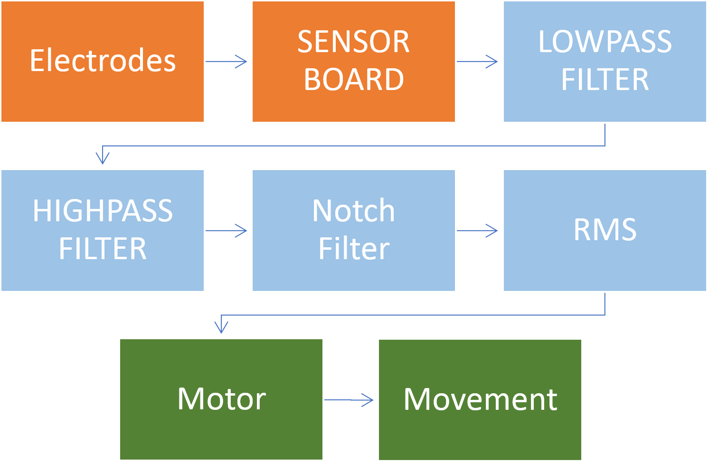
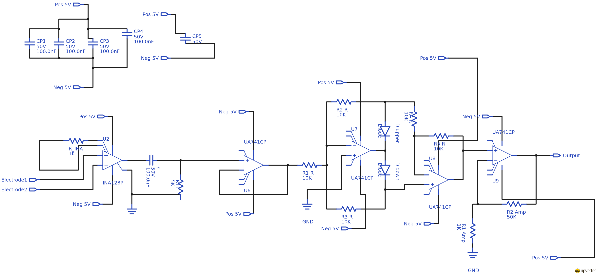
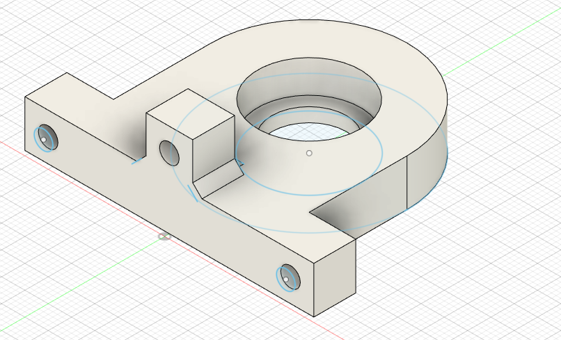

# How I stopped fearing robotics and came to love arduinos
Hello there and welcome to our web page for how to make a "simple" EMG controlled prosthetic. Here you'll find a link to the report , schematics for the senor boards used in this project, arduino code used in the project, 3D print files in both 3D print ready format (stl) and editable format (dwg).  

## Members
Every member was assigned different responsibilities. 
```terminal
Paulo Cruz (paulocn@kth.se)                               - Arduino code
Jonathan Kardelind (jonathan.kardelind@gmail.com)           - Structure (3D and final prototype)
Henrik Malmberg (hmalmbe@kth.se)                          - Arduino code and Motor code
Viktor Stedt (vstedt@kth.se)                              - Sensor board
Mogos Tesfaldet                                           - Arduino code
```

## Table of content
1. [Our report](#our-report)
2. [Movie presentation](#movie-presentation)
3. [Flowchart](#Flowchart)
4. [Arduino code](#Arduino-code)
5. [Sensorboard](#sensorboard)
6. [Pictures and files](#pictures-and-files)
7. [Sprint Schedule](#sprint-Schedule)
8. [Project files](#project-files)

## Our report
[Our report in pdf form](https://drive.google.com/open?id=12bxFbVB4nVtl8Od4FbTfcNld1QJK4DD5)

## Movie presentation
  

[Movie](https://youtu.be/Ifyh3R_fL7w)

## Flowchart


## Arduino Code
```terminal
#include <AccelStepper.h>
#include <MultiStepper.h>

//Out from Arduino
#define dirPin 8                                      //DIR to D8 (pin 11)
#define stepPin 9                                     //STP to D9 (pin 12)
#define motorInterfaceType 1                          //Needed for driver with dir and stp
#define digiStop 2                                    //Digital pin for switch
//Define motor pins
#define motorPin1 4                                   //D4 (pin 7)
#define motorPin2 3                                   //D3 (pin 6)
#define motorPin3 5                                   //D5 (pin 8)
#define motorPin4 6                                   //D6 (pin 9)

//Global variables
#define arrayLength 200                               //Array length of RMS window

//Define step constants
#define HALFSTEP 8

//Inputs outputs 
int analogPin1 = A0;                                  //Analog pin A0
int analogPin2 = A1; 

//Switch detection
int grip = LOW;

//Arrays saving data
  float unfiltered_array[arrayLength];                //Raw input data
  float unfiltered_array2[arrayLength];
  float notch_array[arrayLength];                     //ARRAY FOR SAVING DATA
  float notch_array2[arrayLength];
  //ALWAYS AN ARRAY WITH just 2 NUMBERS
  float LP_array[] = {0.0, 0.0};
  float HP_array[] = {0.0, 0.0};
  float LP_array2[] = {0.0, 0.0};
  float HP_array2[] = {0.0, 0.0};
  int n = 1;                                            //int for last element in short array

//LOW AND HIGHPASS
  int sampleRate = 2000;                                //Sampling in Hz  (1/(executiontime+delay)
  float dt = 1.0/sampleRate;                            //Convert to time
  int LP_F = 50;                                        //Cut off frequencies higher than (LP_F)
  int HP_F = 15;                                        //Let frequencies higher than (HP_F) pass through
  float LP_RC = 1.0/(LP_F*2*3.14);
  float HP_RC = 1.0/(HP_F*2*3.14);
  float LP_alpha = dt/(LP_RC+dt);
  float HP_alpha = HP_RC/(HP_RC+dt);

//NOTCH
  int notchLowF = 49;                                   //Lower end of notch filter frequency
  int notchHighF = 51;                                  //Higher end of notch filter frequency
  float notchLowRC = 1.0/(notchLowF*2*3.14);            //Changed from notchLoWRC -> notchLowF
  float notchHighRC = 1.0/(notchHighF*2*3.14);
  float notchLow_alpha = dt/(notchLowRC+dt);
  float notchHigh_alpha = notchHighRC/(notchHighRC+dt);
  float notchLow; 
  float notchHigh; 
  float bandpass; 
  float bandstop;
  float notchLow2; 
  float notchHigh2; 
  float bandpass2; 
  float bandstop2;

//RMS
  double rootMeanSq;                                     //RMS from one input
  double rootMeanSq2;                                    //RMS from second input
  
//Define motorobject
AccelStepper stepFlexExt(motorInterfaceType, stepPin, dirPin);
AccelStepper stepPinch(HALFSTEP, motorPin1, motorPin3, motorPin2, motorPin4);
  
void setup() {
  //Fill arrays with zeros
  for(int i = 0; i< arrayLength; i++){
  unfiltered_array[i] = 0.0;
  unfiltered_array2[i] = 0.0;
  notch_array[i] = 0.0;
  notch_array2[i] = 0.0;
  }
  
  //Set up motors
  stepFlexExt.setMaxSpeed(1200.0);
  stepFlexExt.setAcceleration(230.0);
  stepFlexExt.setCurrentPosition(0.0);
  stepPinch.setMaxSpeed(1000.0);
  stepPinch.setSpeed(0);
  stepPinch.setAcceleration(150.0);
  stepPinch.setCurrentPosition(0);
  
  //Digital input for switch
  pinMode(digiStop, INPUT);
  
  //Serial.begin(38400);                                  //For observing the 
}

void loop() {
  int data = analogRead(analogPin1);                      // INT between 0-1023
  unfiltered_array[arrayLength-1] = data;                 //last in array eg. 49 
  int data2 = analogRead(analogPin2);
  unfiltered_array2[arrayLength-1] = data2;
  

  //LOWPASS FILTERING
  LP_array[n] = LP_alpha*unfiltered_array[arrayLength-1] + (1-LP_alpha)*LP_array[n-1]; 
  
  //HIGHPASS FILTERING
  HP_array[n] = HP_alpha*(HP_array[n-1]+LP_array[n]-LP_array[n-1]);

  //NOTCH FILTERING
  notchLow = (notchLow_alpha*HP_array[n]) + ((1-notchLow_alpha)*HP_array[n-1]); 
  notchHigh = (notchHigh_alpha*HP_array[n]) + ((1-notchHigh_alpha)*HP_array[n-1]);
  bandpass = notchHigh - notchLow;
  bandstop = HP_array[n] - bandpass;
  notch_array[arrayLength-1] = bandstop;

  //LOWPASS FILTERING2
  LP_array2[n] = LP_alpha*unfiltered_array2[arrayLength-1] + (1-LP_alpha)*LP_array2[n-1]; 
  
  //HIGHPASS FILTERING2
  HP_array2[n] = HP_alpha*(HP_array2[n-1]+LP_array2[n]-LP_array2[n-1]);

  //NOTCH FILTERING2
  notchLow2 = (notchLow_alpha*HP_array2[n]) + ((1-notchLow_alpha)*HP_array2[n-1]); 
  notchHigh2 = (notchHigh_alpha*HP_array2[n]) + ((1-notchHigh_alpha)*HP_array2[n-1]);
  bandpass2 = notchHigh2 - notchLow2;
  bandstop2 = HP_array2[n] - bandpass2;
  notch_array2[arrayLength-1] = bandstop2;
  
  //MOVING RMS WINDOW
  float v = 0.0;                                          //Always zero before new RMS count
  float sum = 0.0;
  float v2 = 0.0;                                         //Always zero before new RMS2 count
  float sum2 = 0.0;
  for (int i = 0; i < arrayLength; i++) {
    sum += notch_array[i]*notch_array[i];
    sum2 += notch_array2[i]*notch_array2[i];
  }
  v = sum/arrayLength;
  v2 = sum2/arrayLength;
  rootMeanSq = sqrt(v);                                   //Calculated RMS of arrayLength
  rootMeanSq2 = sqrt(v2);

  //STORING IN ARRAY
  LP_array[n-1] = LP_array[n];
  HP_array[n-1] = HP_array[n];
  LP_array2[n-1] = LP_array2[n];
  HP_array2[n-1] = HP_array2[n];
  for(int i = 0; i < arrayLength-1; i++){                
    unfiltered_array[i] = unfiltered_array[i+1];
    notch_array[i] = notch_array[i+1];
    unfiltered_array2[i] = unfiltered_array2[i+1];
    notch_array2[i] = notch_array2[i+1];
  }
  /*Serial.print(rootMeanSq);                            //Print out Root mean square value
  Serial.print(", ");
  Serial.print(rootMeanSq2);*/
  if(rootMeanSq < 80 || rootMeanSq2 < 80){               //Removing sudden high amplitude noice
  //Pinch control
    if(rootMeanSq2 > 17 && grip ==HIGH){
      stepPinch.moveTo(stepPinch.currentPosition() -50);
    }
    if(rootMeanSq2 < 5){
      stepPinch.moveTo(stepPinch.currentPosition() +50);
    }
  //Fextion/extension control
    if(rootMeanSq >6 && rootMeanSq < 23){
      stepFlexExt.moveTo(stepFlexExt.currentPosition() );
    }else{
      if(rootMeanSq > 23  && stepFlexExt.currentPosition() <= 9190){
        stepFlexExt.moveTo(stepFlexExt.currentPosition() + 1200);
      }
      if(rootMeanSq < 5 && stepFlexExt.currentPosition()> 1200){
        stepFlexExt.moveTo(stepFlexExt.currentPosition() - 1200);
      }
    }
  }
  //Motor + creating delay until next sensor board readout
  for(int i = 0; i<=25; i++){
    grip = digitalRead(digiStop);
    if(grip == LOW){                                      //If switch is connected
      stepPinch.moveTo(stepPinch.currentPosition() );
    } else {
      stepPinch.run();
    }
    stepFlexExt.run();
    delayMicroseconds(20);
  }
  /*Serial.print("; ");                                   //Observing input of grip
  Serial.println(grip);*/
}

```
## Sensorboard
Creating our own sensorboard to pick up transmit the EMG signal.

[Upvert file](Projects/Roboticarm_openjson.upv)

## Pictures and files


[stl file](Projects/Holder_Ball_Bearing_1mm_off/Holder_Ball_Bearing_1mm_off.stl) &
[dwg file](Projects/Holder_Ball_Bearing_1mm_off/Holder_Ball_bearing_1mm_off.dwg)  


[stl file](Projects/roller_that_works_like_a_holder/roller_that_works_like_a_holder.stl) &
[dwg file](Projects/roller_that_works_like_a_holder/roller_that_works_like_a_holder.dwg)  


[stl file for left side](Projects/sensorholders/sensorholder_left.stl) and 
[stl file for right side](Projects/sensorholders/sensorholder_right.stl) &
[dwg file](Projects/sensorholders/sensorholders.dwg) 


[stl file](Projects/Hand%20part/Hand_part.stl) &
[dwg file](Projects/Hand%20part/Hand%20part.dwg) 
 
## Sprint Schedule
[Our sprint schedule](https://drive.google.com/open?id=1MaNDce9rP6RRyLRTfPT3aKyGw1Nl4HoCjJTL1nX9wjU)

## Project files
[Here is everything collected so that you can do the same as us](https://drive.google.com/open?id=1bXBbQGF10dLjjT2bCN0wZYgyClIOmIcx)
